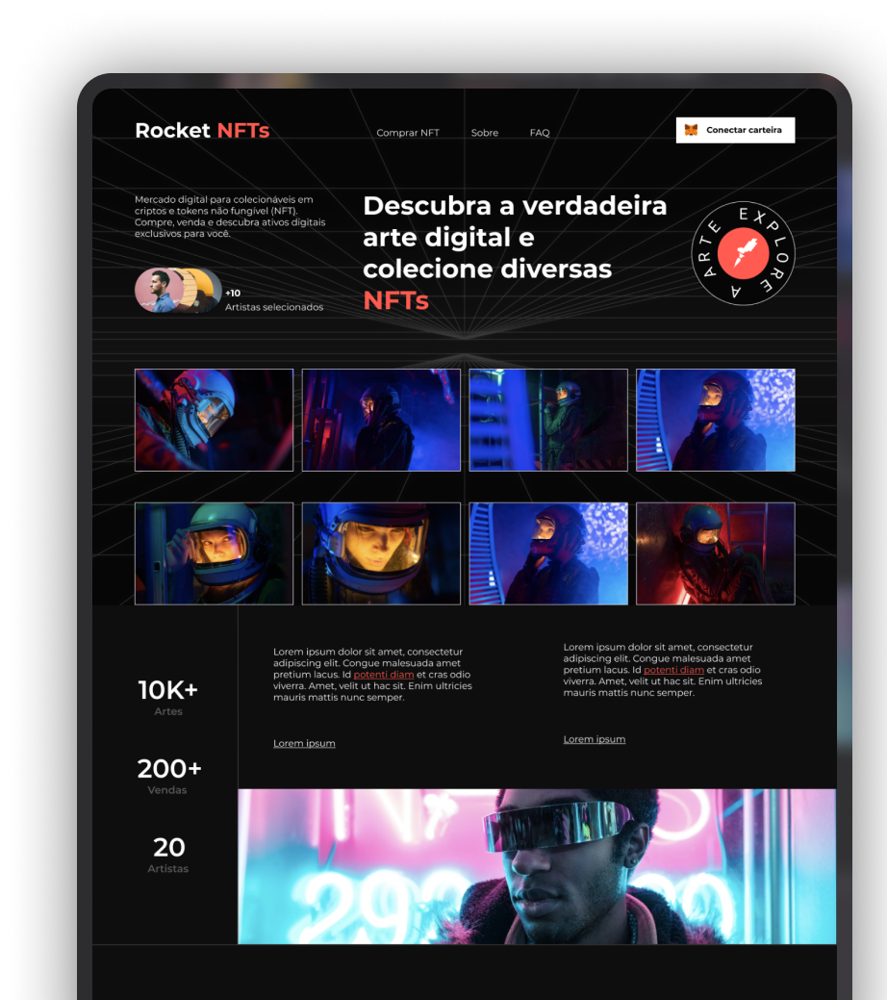

<h1 align="center">Rocket Nfts</h1>

Programa exclusivo e  gratuito, promovido pela Rocketseat para ensino de tecnologias WEB.

  <a href="#-tecnologias">Tecnologias</a>&nbsp;&nbsp;&nbsp;|&nbsp;&nbsp;&nbsp;
  <a href="#-projeto">Projeto</a>&nbsp;&nbsp;&nbsp;|&nbsp;&nbsp;&nbsp;
  <a href="#-layout">Layout</a>&nbsp;&nbsp;&nbsp;|&nbsp;&nbsp;&nbsp;
  <a href="#memo-licença">Licença</a>

  

 

  

## 🚀 Tecnologias

Esse projeto foi desenvolvido com as seguintes tecnologias:

- HTML e CSS
- Git e Github
- Figma
- Tailwind CSS

## 💻 Projeto

Projeto feito seguindo o desafio da Rocketseat com base no figma, utilizando a  ferramenta Tailwind CSS.

Veja como instalar o Tailwind CSS passo a passo em sua máquina. [Documentção do Tailwind CSS ](https://tailwindcss.com/docs/installation)

## 🔖 Layout

Você pode visualizar o layout do projeto através [DESSE LINK](https://www.figma.com/file/6GoqSBKUMIxxLWuX3WTtgQ/Rocket-NFTs-%E2%80%A2-Desafio-Discover-(Community)?node-id=1%3A3&mode=dev). É necessário ter conta no [Figma](https://figma.com) para acessá-lo.

## :memo: Licença

Esse projeto está sob a licença MIT.

---

Feito com ♥ by Kaio Torres :wave: [Veja meu cartão de visita](https://kaiotorrers19.github.io/projeto_apresentacao_portifolio-/)
